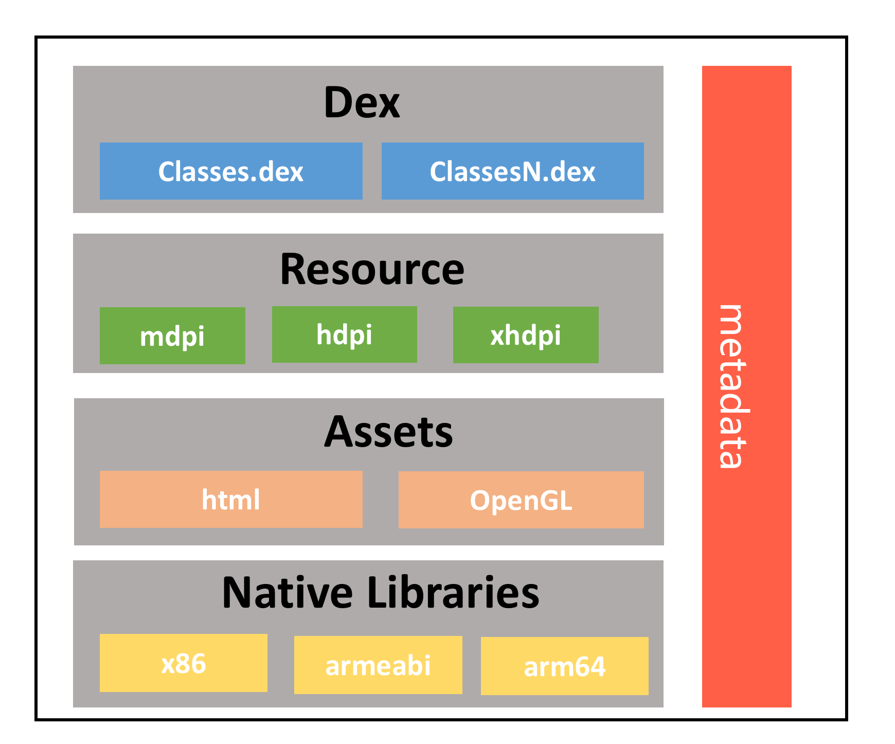
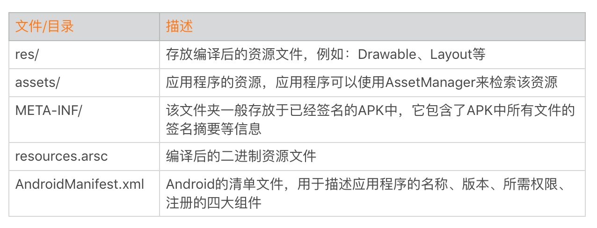

# 包体积优化



事实上安装包中无非就是 Dex、Resource、Assets、Library 以及签名信息这五部分。

## 代码
也就是Dex文件的数量。[参考](https://blog.dreamtobe.cn/android_d8_r8/)

> 其实单就优化dex的文件大小与运行时性能，最出名的开源解决方案应该是Facebook的redex。

* Dex编译时间更短
* .dex文件大小更小
* D8编译的.dex文件将拥有相同或者是更好的运行时性能
* Java 8支持

###  去掉 Debug 信息或者去掉行号

某个应用通过相同的 ProGuard 规则生成一个 Debug 包和 Release 包，其中 Debug 包的大小是 4MB，Release 包只有 3.5MB。既然它们 ProGuard 的混淆与优化的规则是一样的，那它们之间的差异在哪里呢？**那就是 DebugItem。**

DebugItem 里面主要包含两种信息：

1. 调试的信息 。函数的参数变量和所有的局部变量。
2. 排查问题的信息。所有的指令集行号和源文件行号的对应关系。

### [Redex](https://github.com/facebook/redex)

ReDex 这个库里面的好东西实在是太多了，其中去除 Debug 信息是通过 StripDebugInfoPass 完成。

```
{
  "redex" : {
    "passes" : [
      "StripDebugInfoPass"
    ]
  },
  "StripDebugInfoPass" : {
    "drop_all_dbg_info" : "0",     // 去除所有的 debug 信息，0 表示不去除
    "drop_local_variables" : "1",  // 去除所有局部变量，1 表示去除
    "drop_line_numbers" : "0",     // 去除行号，0 表示不去除
    "drop_src_files" : "0",        
    "use_whitelist" : "0",
    "drop_prologue_end" : "1",
    "drop_epilogue_begin" : "1",
    "drop_all_dbg_info_if_empty" : "1"
  }
}

```

## Dex分包
简单来说，如下图所示如果将 Class A 与 Class B 分别编译到不同的 Dex 中，由于 method a 调用了 method b，所以在 classes2.dex 中也需要加上 method b 的 id。因为跨 Dex 调用造成的这些冗余信息，它对我们 Dex 的大小造成这些影响呢：

1. method id爆表。我们都知道每个 Dex 的 method id 需要小于 65536，因为 method id 的大量冗余导致每个 Dex 真正可以放的 Class 变少，这是造成最终编译的Dex 数量增多
2. 信息冗余。因为我们需要记录跨 Dex 调用的方法的详细信息，所以在 classes2.dex 我们还需要记录 Class B 以及 method b 的定义，造成 `string_ids`、`type_ids`、`proto_ids` 这几部分信息的冗余。


### ReDex 在分析类调用关系后，使用的是贪心算法计算局部最优值

```
{
  "redex" : {
    "passes" : [
      "InterDexPass"
    ]
  },
  "InterDexPass" : {
    "minimize_cross_dex_refs": true,
    "minimize_cross_dex_refs_method_ref_weight": 100,
    "minimize_cross_dex_refs_field_ref_weight": 90,
    "minimize_cross_dex_refs_type_ref_weight": 100,
    "minimize_cross_dex_refs_string_ref_weight": 90
  }
}

```

## 分析FaceBook APK包
### 1. Dex压缩

Facebook 的 App 只有一个 700 多 KB 的 Dex。Google Play 是不允许动态下发代码的，那它的代码都放到哪里了呢？事实上，Facebook App 的 classes.dex 只是一个壳，真正的代码都放到 assets 下面。它们把所有的 Dex 都合并成同一个 secondary.dex.jar.xzs 文件，并通过 XZ 压缩。

[XZ 压缩算法](https://tukaani.org/xz/)和 7-Zip 一样，内部使用的都是 LZMA 算法。对于 Dex 格式来说，XZ 的压缩率可以比 Zip 高 30% 左右。但是这套方案似乎存在一些问题：

1. 首次启动解压。应用首次启动的时候，需要将 secondary.dex.jar.xzs 解压缩，假设一共有 11 个 Dex。Facebook 使用多线程解压的方式，这个耗时在高端机是几百毫秒左右，在低端机可能需要 3～5 秒。**这里为什么不采用 Zstandard 或者 Brotli 呢？主要是压缩率与解压速度的权衡。**
2. ODEX 文件生成，当 Dex 非常多的时候会增加应用的安装时间。对于 Facebook 的这个做法，首次生成 ODEX 的时间可能就会达到分钟级别。Facebook 为了解决这个问题，使用了 ReDex 另外一个超级硬核的方法，那就是[oatmeal](https://github.com/facebook/redex/tree/master/tools/oatmeal)

> oatmeal 的原理非常简单，就是根据 ODEX 文件的格式，自己生成一个 ODEX 文件。它生成的结果跟解释执行的 ODEX 一样，内部是没有机器码的。

对于正常的流程，我们需要 fork 进程来生成 dex2oat，这个耗时一般都比较大。通过 oatmeal，我们直接在本进程生成 ODEX 文件。一个 10MB 的 Dex，如果在 Android 5.0 生成一个 ODEX 的耗时大约在 10 秒以上，在 Android 8.0 使用 speed 模式大约在 1 秒左右，而通过 oatmeal 这个耗时大约在 100 毫秒左右。

### 2. Native Library

* Library 压缩。跟 Dex 压缩一样，Library 优化最有效果的方法也是使用 XZ 或者 7-Zip 压缩。
* Facebook 有一个 So 加载的开源库[SoLoader](https://github.com/facebook/SoLoader)。它和 Dex 压缩一样，压缩方案的主要缺点在于首次启动的时间，毕竟对于低端机来说，多线程的意义并不大，因此我们要在包体积和用户体验之间做好平衡。

* Library 合并与裁剪

	> 对于 Native Library，Facebook 中的编译构建工具[Buck](https://buckbuild.com/)有很多方法。在 Android 4.3 之前，进程加载的 Library 数量是有限制的。在编译过程，我们可以自动将部分 Library 合并成一个。[具体思路参考文章](https://code.fb.com/android/android-native-library-merging/)
	
	> [Relinker](https://github.com/facebook/buck/blob/master/src/com/facebook/buck/android/relinker/NativeRelinker.java)可以实现裁剪，原理就是分析代码中 JNI 方法以及不同 Library 的方法调用，找到没有无用的导出 symbol，将它们删掉。这样 linker 在编译的时候也会把对应的无用代码同时删掉，这个方法相当于实现了 Library 的 ProGuard Shrinking 功能。


## 包体积监控
[Matrix-ApkChecker](https://mp.weixin.qq.com/s/tP3dtK330oHW8QBUwGUDtA)


## 资源部分优化
美团的一篇文章[《Android App 包瘦身优化实践》](tech.meituan.com/2017/04/07/android-shrink-overall-solution.html)中，也讲到了很多资源优化相关的方法，例如 WebP 和 SVG、R 文件、无用资源、资源混淆以及语言压缩等。




## [AndResGuard](https://github.com/shwenzhang/AndResGuard)

它主要有两个功能，一个是资源混淆，一个是资源的极限压缩。

### 资源混淆
ProGuard 的核心优化主要有三个：Shrink、Optimize 和 Obfuscate，也就是裁剪、优化和混淆。当初我在写 AndResGuard 的时候，希望实现的就是 ProGuard 中的混淆功能。

对这些资源的优化：

* resources.arsc。因为资源索引文件 resources.arsc 需要记录资源文件的名称与路径，使用混淆后的短路径 res/s/a，可以减少整个文件的大小。
* metadata 签名文件。签名文件 MF 与 SF都需要记录所有文件的路径以及它们的哈希值，使用短路径可以减少这两个文件的大小。
* ZIP 文件索引。ZIP 文件格式里面也需要记录每个文件 Entry 的路径、压缩算法、CRC、文件大小等信息。使用短路径，本身就可以减少记录文件路径的字符串大小。

> 资源文件有一个非常大的特点，那就是文件数量特别多。以微信 7.0 为例，安装包中就有 7000 多个资源文件。所以说，资源混淆工具仅仅通过短路径的优化，就可以达到减少 resources.arsc、签名文件以及 ZIP 文件大小的目的。


### 极限压缩
* 更高的压缩率。虽然我们使用的还是 Zip 算法，但是利用了 7-Zip 的大字典优化，APK 的整体压缩率可以提升 3% 左右。
* 压缩更多的文件。Android 编译过程中，下面这些格式的文件会指定不压缩；在 AndResGuard 中，我们支持针对 resources.arsc、PNG、JPG 以及 GIF 等文件的强制压缩。

```
/* these formats are already compressed, or don't compress well */
static const char* kNoCompressExt[] = {
    ".jpg", ".jpeg", ".png", ".gif",
    ".wav", ".mp2", ".mp3", ".ogg", ".aac",
    ".mpg", ".mpeg", ".mid", ".midi", ".smf", ".jet",
    ".rtttl", ".imy", ".xmf", ".mp4", ".m4a",
    ".m4v", ".3gp", ".3gpp", ".3g2", ".3gpp2",
    ".amr", ".awb", ".wma", ".wmv", ".webm", ".mkv"
};

```

> Android 6.0 之后 AndroidManifest 支持不压缩 Library 文件，这样安装 APK 的时候也不需要把 Library 文件解压出来，系统可以直接 mmap 安装包中的 Library 文件。android:extractNativeLibs=“true”


### 去除无用资源方案演进

#### 第一阶段 Lint
我们每天都在用的Lint。Lint 作为一个静态扫描工具，它最大的问题在于没有考虑到 ProGuard 的代码裁剪。在 ProGuard 过程我们会 shrink 掉大量的无用代码，但是 Lint 工具并不能检查出这些无用代码所引用的无用资源。

#### 第二阶段 shrinkResources
所以 Android 在第二阶段增加了“shrinkResources”资源压缩功能，它需要配合 ProGurad 的“minifyEnabled”功能同时使用。

```
android {
    ...
    buildTypes {
        release {
            shrinkResources true
            minifyEnabled true
        }
    }
}

```

但是它有如下问题：

* 没有处理 resources.arsc 文件。这样导致大量无用的 String、ID、Attr、Dimen 等资源并没有被删除。
* 没有真正删除资源文件。对于 Drawable、Layout 这些无用资源，shrinkResources 也没有真正把它们删掉，而是仅仅替换为一个空文件。为什么不能删除呢？主要还是因为 resources.arsc 里面还有这些文件的路径。在继续深究需要了解Android编译流程。

##### Android编译流程


* 由于 Java 代码需要用到资源的 R.java 文件，所以我们就需要把 R.java 提前准备好。
* 在编译 Java 代码过程，已经根据 R.java 文件，直接将代码中资源的引用替换为常量，例如将 R.String.sample 替换为 0x7f0c0003。
* .ap_ 资源文件的同步编译，例如 resources.arsc、XML 文件的处理等。

如果我们在这个过程强行把无用资源文件删除，resources.arsc 和 R.java 文件的资源 ID 都会改变（因为默认都是连续的），这个时候代码中已经替换过的 0x7f0c0003 就会出现资源错乱或者找不到的情况。


### 第三阶段：realShrinkResources
> 因此了解了这些步骤之后有一个思路： keep 住保留资源的 ID，保证已经编译完的代码可以正常找到对应的资源。

> 也就是重写 resources.arsc。但是这样会比资源混淆更加复杂，我们既要从这个文件中抹去所有的无用资源相关信息，还要 keep 住所有保留资源的 ID，相当于把整个文件都重写了。