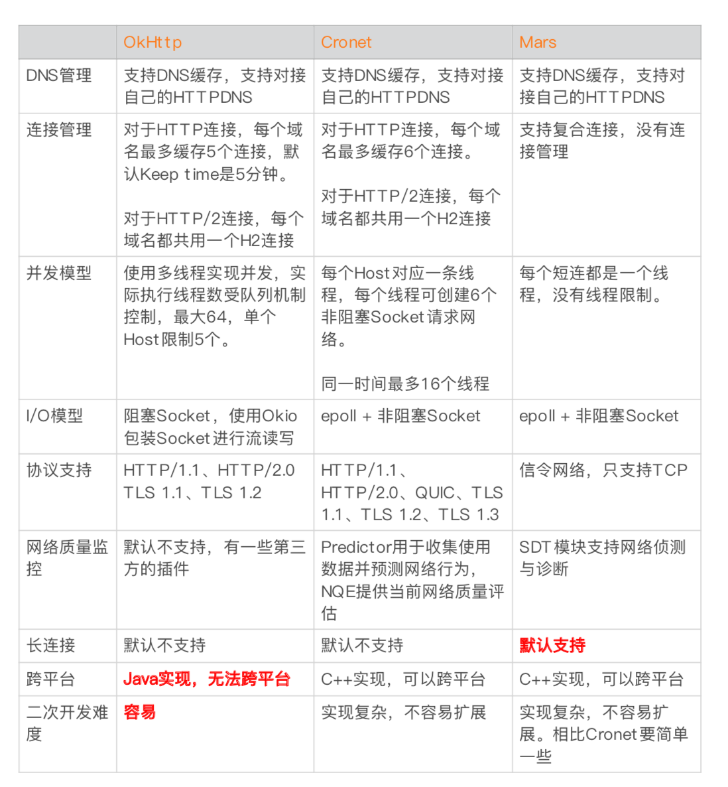

# 移动端网络

### 网络请求的过程
1. DNS解析
2. 创建连接：TCP三次握手
3. 发送/接收数据
4. 关闭连接：主动、被动

## 网络库

对于 Mars 来说，它是一个跨平台的 Socket 层解决方案，并不支持完整的 HTTP 协议，所以 Mars 从严格意义上来讲并不是一个完整的网络库。但是它在弱网络和连接上做了大量的优化，并且支持长连接。

## HTTPDNS
LocalDNS 存在诸多问题：

* 稳定性。UDP 协议，无状态，容易域名劫持（难复现、难定位、难解决），每天至少几百万个域名被劫持，一年至少十次大规模事件。
* 准确性。LocalDNS 调度经常出现不准确，比如北京的用户调度到广东 IP，移动的运营商调度到电信的 IP，跨运营商调度会导致访问慢，甚至访问不了。
* 及时性。运营商可能会修改 DNS 的 TTL，导致 DNS 修改生效延迟。不同运营商的服务实现不一致，我们也很难保证 DNS 解析的耗时。

比如微信有自己部署的 NEWDNS，阿里云和腾讯云也有提供自己的 HTTPDNS 服务。对于大网络平台来说，我们会有统一的 HTTPDNS 服务，并将它和运维系统打通。在传统的 DNS 基础上，还会增加精准的流量调度、网络拨测 / 灰度、网络容灾等功能。

## HTTP/2.0 的多路复用

网络库并不会立刻把连接释放，而是放到连接池中。这时如果有另一个请求的域名和端口是一样的，就直接拿出连接池中的连接进行发送和接收数据，少了建立连接的耗时。

**不过这里需要注意的是 H2 的多路复用在本质上依然是同一条 TCP 连接，如果所有的域名的请求都集中在某一条连接中，在网络拥塞的时候容易出现 TCP 队首阻塞问题。**

## 压缩、加密
HTTP2 本身已有Header压缩，因此需要压缩的主要是请求 URL 和请求 body。

对于请求 body 来说，一方面是数据通信协议的选择，在网络传输中目前最流行的两种数据序列化方式是 JSON 和 Protocol Buffers。正如我之前所说的一样，Protocol Buffers 使用起来更加复杂一些，但在数据压缩率、序列化与反序列化速度上面都有很大的优势。

另外一方面是压缩算法的选择，通用的压缩算法主要是如 gzip，Google 的Brotli或者 Facebook 的Z-standard 都是压缩率更高的算法。其中如果 Z-standard 通过业务数据样本训练出适合的字典，是目前压缩率表现最好的算法。但是各个业务维护字典的成本比较大，这个时候我们的大网络平台的统一接入层又可以大显神威了。

当然针对特定数据我们还有其他的压缩方法，例如针对图片我们可以使用 webp、hevc、[SharpP](https://mp.weixin.qq.com/s/JcBNT2aKTmLXRD9zIOPe6g) 等压缩率更高的格式。另外一方面，还有基于 AI 的[图片超清化](http://imgtec.eetrend.com/d6-imgtec/blog/2017-08/10143.html)

## 安全
HTTPS 的优化有下面几个思路：

* 连接复用率。通过多个域名共用同一个 HTTP/2 连接、长连接等方式提升连接复用率。
* 减少握手次数。[TLS 1.3](https://zhuanlan.zhihu.com/p/44980381)  [微信的mmtls](https://mp.weixin.qq.com/s/tvngTp6NoTZ15Yc206v8fQ) [Facebook的fizz](https://mp.weixin.qq.com/s?__biz=MzI4MTY5NTk4Ng==&mid=2247489465&idx=1&sn=a54e3fe78fc559458fa47104845e764b)

## 参考
* [Mars](https://github.com/Tencent/mars/wiki)
* [百度App网络深度优化系列《一》DNS优化](https://mp.weixin.qq.com/s/iaPtSF-twWz-AN66UJUBDg)